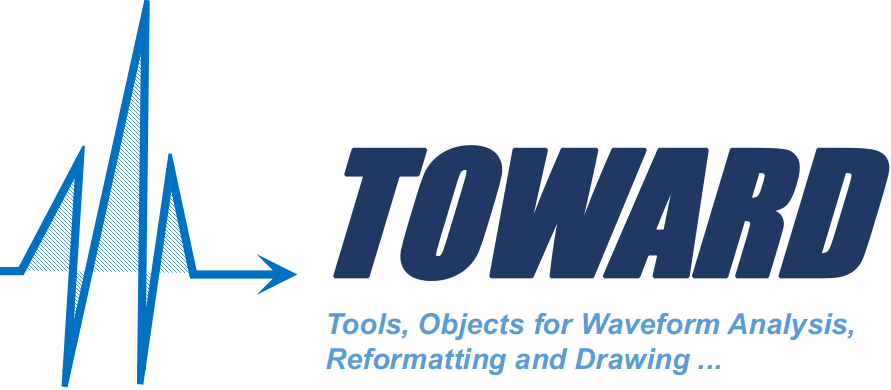
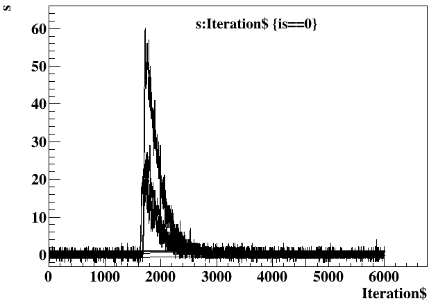
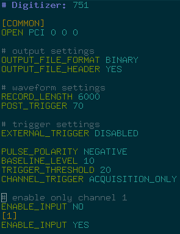

[Python][] and [ROOT][] scripts for the process of digital waveforms taken with a [CAEN][] [digitizer][] and its [WaveDump][] readout program.

[Git]:https://git-scm.com/
[Python]:https://www.python.org/
[ROOT]:https://root.cern.ch
[CAEN]:https://www.caen.it/
[digitizer]:https://www.caen.it/sections/digitizer-families/
[WaveDump]:https://www.caen.it/products/caen-wavedump/

[](#getting-started)
[](#wavedump-configurations)

## Prerequisites

[CAEN][] [WaveDump][] is not needed to run the scripts here, but its output is the input for these scripts. A few example [WaveDump][] output files named as `wave0.dat` are included in the run data folder [2020](2020) so that the processing scripts can be tested without running [WaveDump][].

CERN [ROOT][] is needed to run scripts ended with `.C`. The [binary distribution of ROOT 5.34/38 for Windows](https://root.cern/releases/release-53438/) is good enough for this project and should be used before [version 6](https://root.cern/install/all_releases) for Windows becomes stable.

[Python][] is available for Linux, Mac and Windows. [Python][] packages [Uproot4][], [awkward][] and [matplotlib][] are needed. They can be installed as a normal user using the [pip][] command:

```sh
$ pip install --upgrade pip # upgrade pip
$ pip install uproot4
$ pip install awkward
$ pip install matplotlib
```

[awkward]:https://pypi.org/project/awkward/
[matplotlib]:https://matplotlib.org/
[pip]:https://pypi.org/project/pip/

## Getting started

### Exploring example data

A few example [WaveDump][] output files named as `wave0.dat` are included in the folder [2020](2020) to demonstrate the usage of the processing scripts. To explore them, please

1. download the package from <https://github.com/jintonic/toward.git>
2. get to the `toward` directory, double click [w2r.py](w2r.py) to convert `wave?.dat` to `wave?.root`. The script can also be run in a terminal as `python3 w2r.py` or simply `./w2r.py`. Note that in [Git Bash][] or [MobaXterm][], the command has to be changed to `winpty python w2r.py` to enable [running Python installed in Windows in a Linux-like terminal](https://stackoverflow.com/questions/48199794/winpty-and-git-bash)
3. click `Show` button on the window created by running [w2r.py](w2r.py) to show waveforms in newly created `wave?.root` using script [show.py](show.py)
4. use other scripts to process the generated root file

[Git Bash]:https://gitforwindows.org/
[MobaXterm]:https://mobaxterm.mobatek.net/

### Analyzing new data

1. create a new run data folder named `yyyy/mm/dd/HHMM/` in your local copy of `toward`
2. get into the just created folder and create a [WaveDump][] configuration file there named [WaveDumpConfig.txt](2020/12/16/2225/WaveDumpConfig.txt)
3. run `wavedump WaveDumpConfig.txt` there to create binary output file `wave?.dat`, where `?` is the channel number. Note that in Window, you may have to run [WaveDump][] from its installation folder, its configuration file and output files need to be copied or moved from there to the newly created folder. In order for [w2r.py](w2r.py) to process the configuration file properly, please don't name it other than `WaveDumpConfig.txt`. Settings that can be tuned in the configuration file can be found in the WaveDump [manual][].
4. follow the previous section starting from step 2.

## Scripts

- [w2r.C](w2r.C): a [ROOT script][] to convert a [CAEN][] [WaveDump][] binary output to [ROOT][] format, align baselines of waveforms to zero, and save basic parameters of waveforms
- [w2r.py](w2r.py): a [Python][] script to fetch information from a [WaveDump][] configuration file and pass it to [w2r.C](w2r.C)
- [q2i.C](q2i.C): a [ROOT script][] to get heights of charge pulses using [trapezoidal filter](https://nukephysik101.wordpress.com/2020/03/20/trapezoid-filter/) and convert charge pulses to current ones using [numerical differentiation](https://terpconnect.umd.edu/%7Etoh/spectrum/Differentiation.html)
- [i2q.C](i2q.C): a [ROOT script][] to convert current pulses to charge ones
- [integrate.C](integrate.C): a [ROOT script][] to integrate waveforms in a certain range and save the result to the original data [tree][]
- [show.py](show.py): a [Python][] script to show waveforms in a [ROOT][] file.

## Features

- Works with [WaveDump][] without any modification of code on both sides
- All scripts can be run directly in Linux, Mac and Windows without compilation and installation
- GUI across three major platforms
- Data are saved as basic types in [ROOT][] [TTree][] [ntuple][]s, which can be easily open without loading extra libraries defining complicated data structure. [Uproot4][] can be used to load the data for analysis in [Python][]
- Super short variable names for quick analysis using [ROOT][] [TTree][]::[Draw][] function in a [ROOT interactive session](https://root.cern.ch/root/html534/guides/users-guide/GettingStarted.html). For example,
```cpp
[root] t->Draw("s:Iteration$","is==0","l",5,2)
```
shows 5 non-saturated (`is==0`) waveforms (`s`: individual waveform samples, [Iterations][Draw]\$: sample index) starting from event 2:



[tree]:https://root.cern.ch/doc/master/classTTree.html#addcoltoexistingtree
[TTree]: https://root.cern.ch/root/htmldoc/guides/users-guide/Trees.html
[ntuple]:https://en.wikipedia.org/wiki/Tuple
[Uproot4]:https://github.com/scikit-hep/uproot4
[Draw]:https://root.cern.ch/doc/master/classTTree.html#a73450649dc6e54b5b94516c468523e45
[ROOT script]:https://root.cern.ch/root/htmldoc/guides/users-guide/Cling.html

## Data structure

The way to organize digital waveform data depends on analysis tools and ecosystem to be used. A [class][] named `Waveform` or `Waveforms` may not be the best choice. Generally speaking, data structures are the way we organize information on our computer; it should involve things more than just [data members][] of a [class][]. For example, a well designed directory structure and output file naming scheme may simplify the coding significantly. They should be considered as a part of data structure.

[class]:https://en.wikipedia.org/wiki/Class_(computer_programming)
[data members]:http://www.cplusplus.com/doc/tutorial/classes/

[WaveDump][] saves waveforms from each channel separately, for example, `wave0.dat` is from channel 0. They are organized in folders named as `yyyy/mm/dd/HHMM/`. [2020](2020) contains example data. They serve as test input of the processing scripts. One can use them to experience the power of TOWARD without physically owning a [CAEN][] [digitizer][].

- [2020/12/02/1444](2020/12/02/1444) contains waveforms from a HPGe detector taken with a [DT5720B][] digitizer
- [2020/11/27/2158](2020/11/27/2158) contains waveforms from a Hamamatsu SiPM module taken with a [DT5751][] digitizer
- [2020/12/16/2225](2020/12/16/2225) contains coincidently triggered waveforms from two SiPMs sandwiching a BGO crystal taken with a [DT5751][] digitizer

## WaveDump configurations

- [2020/12/16/2225/WaveDumpConfig.txt](2020/12/16/2225/WaveDumpConfig.txt) can be used as an example [WaveDump][] configuration file that can be copied to other folders as a starting point for customization. It also demonstrates how to set up coincident trigger among channels

### Output file settings

Make sure that the following two options are set as follows in your [WaveDump][] configuration file:

```sh
# By default the WaveDump output file format is ASCII,
# we need to change it to BINARY to save disk space.
OUTPUT_FILE_FORMAT BINARY

# By default WaveDump does not attach a header to each waveform, 
# we need to enable it to know the size of a waveform data block.
OUTPUT_FILE_HEADER YES
```

According to the WaveDump [manual][], the header is simply six 32-bit integers:

1. event size in byte (HEADER size + sample size)
2. board Id
3. pattern a VME specific parameter
4. channel Id
5. event Id
6. trigger time tag

It is followed by waveform samples as 16 or 8-bit integers.

### Syntax highlighting

[share/vim/syntax/WDcfg.vim](share/vim/syntax/WDcfg.vim) enables [syntax highlighting][1] of a [WaveDump][] configuration file in [vim][]. It can be installed the following way in Linux or Mac:

```sh
$ mkdir -p ~/.vim/after/syntax
$ cp share/vim/syntax/WDcfg.vim ~/.vim/after/syntax
```

If you don't have file `~/.vim/after/filetype.vim`, create one and put the following content in it to let [vim][] recognize the `filetype` of `WaveDumpConfig.txt` as `WDcfg` instead of `text`:

```vim
if exists("did_load_filetypes_userafter")
  finish
endif
let did_load_filetypes_userafter = 1
augroup filetypedetect
  au! BufNewFile,BufRead WaveDumpConfig*.txt if &ft == 'text' | set ft=WDcfg | endif
augroup END
```

A [WaveDump][] configuration file may look like the following in vim with [syntax highlighting][1] enabled:



[1]:https://en.wikipedia.org/wiki/Syntax_highlighting
[vim]:https://www.vim.org/
[DT5751]:https://www.caen.it/products/dt5751/
[manual]:https://usermanual.wiki/Document/UM2091WaveDumpUserManualrev13.87092449/view
